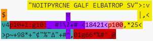
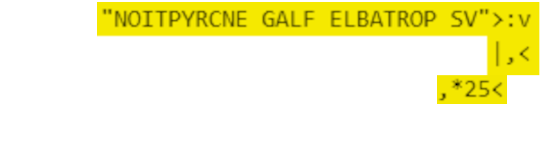
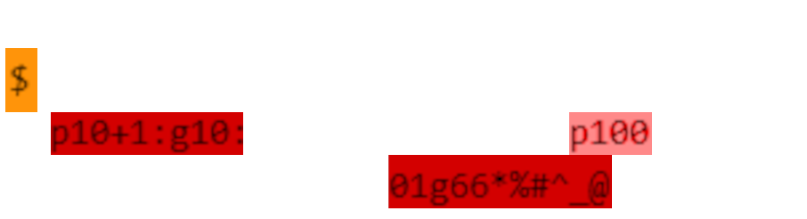
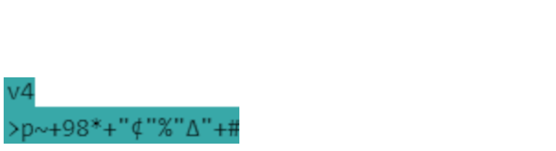

# Portable Crypto

### Description
I keep getting complaints about file size, so I made an encryption scheme using only a few characters!

### Exploration
_crypto.bf_
```
       "NOITPYRCNE GALF ELBATROP SV">:v
$                v                  |,<
v4p10+1:g10:_ #!\?+# <18421<p100,*25<
>p~+98*+"¢"%"Δ"+#^,01g66*%#^_@
(insert unholy unprintable characters here)
```
_out.txt_
```
VS PORTABLE FLAG ENCRYPTION
ξέΠαΣεΝПЪвЭΡΫΥТμеЬаГΧιМИΟФΜήГΰбНЭЏЃκ
```

When I first downloaded the files, I was tipped off at first by the file extension .bf, because my first thought was "oh cool, a Brainfuck challenge!" I've spent a decent amount of time messing around with Brainfuck, so I was already thinking about esoteric programming languages when I opened it up. As it clearly wasn't Brainfuck, however, I noticed this block of characters:
```
>:v
|,<
```
It looks suspiciously like arrows going in a circle, and if there's any esoteric programming language I know that has 2D arrows going in a circle, it's BeFunge! (https://esolangs.org/wiki/Befunge) Befunge is another language that was designed to be hell on whoever would work on backend things for it, except it was about building any compiler at all, instead of the smallest one in the case of Brainfuck. In a word, Befunge is 2D - designed to have a pointer on the code that moves around based on arrows that it encounters, conditional pipes, and, in the case of ?, _just picking a direction at random_. After finding a Befunge interpreter online (which actually doesn't work correctly - we'll get to that), I stepped through the Befunge to figure out exactly what it does

### Solution


Befunge will start in the upper left, going to the right, running through the code. As noted in the Befunge documentation on the esolang wiki above, it's almost entirely stack-based, with any variables and registers having to be stored on either the stack or in the codespace itself. The introductory print code (colored in yellow) is the Befunge hallmark to how one prints out text.

#### Printing Section


The upper part pushes, as a string, "VS PORTABLE FLAG ENCRYPTION" onto the stack, but has to do it backwards - first in, last out. The arrow loop will duplicate the top of the stack (**:**), pop the stack and print that character (**,**), then pop the stack and check for 0 (**|**). If the stack has no contents, popping the stack results in a zero, so after all the characters are printed, the | check will go down instead of up. 
The arrow redirects the code to go right-to-left, pushes 5 and 2 onto the stack, multiplies them (10), and then prints that (to get a new line). The interpreter made this step super-clear to understand, and gave a good head start into understanding Befunge's operation.

#### RNG section


When running the interpreter at full-speed, the pointer spends a lot of time bouncing around the **?** character, so I made it a mission to understand exactly what it was doing. ?, by itself, picks a random direction for the code execution to continue in. The arrows at the top and bottom contain the execution, so only going left or right will actually do anything. 
When going to the right, it adds the two top values on the stack and returns (the **#** is a bridge, which lets you execute the plus when coming from the left, but hops over it coming from the right.). 
When going to the left, it swaps the top two values of the stack (**\\**), NOTs the top of the stack (**!**), and if that value is 0, it comes back. Otherwise, it continues.

Grappling with this for a long time, I finally came to realize this is obfsucated RNG. The stack is set up initialized with the light purple to be (1,8,4,2,1), and each (relevant) step will either combine the values on the stack or delete the second value from the top. Once there is only one value remaining, the left branch will end up grabbing a 0, NOTing it to a 1, and allowing execution to continue, with one random value on the stack.

This was probably the worst part to understand, and once it was clear, the rest falls into place.

#### Loop structure


All of this code is the structure that allows execution to get all 36 characters encrypted. These heavily rely on **p** and **g**, so it's worth going over what they do. **g** is a get function with two stack arguments, y and x, that gets the value in the 2D cell in the codespace. **p** is a put function with three arguments, y, x, and val, that puts the value specified into that 2D cell. 
The light red, for example, has the stack as (1,0,0), so it puts the value 0 at (0,1), which is the location of the orange **$**. The ASCII value of **$** is 36, and the length of our flag is 36, so this cell is the location of the loop variable that tells us how many characters to encrypt. This also indicates that this is the code _after_ all the execution has occurred - so the junk at the bottom layer of the program is likely variables created during execution.

The left block of red code increments the loop variable - `(get(0,1), dup, add 1, put(0,1,val))`. So we now know that the code prints a header, gets 36 random numbers, and then ends execution at the **@**. The rest of the code must be how our flag is encrypted.

#### Encryption section

Since there's no branching in this, we can make this more linear and break down the actual execution:
* **4p** - The loop variable was duplicated earlier, so this is `put(4,i,rnd)`. This confirms the fact that the junk at the bottom is relevant - it's the list of random numbers for each iteration.
* **~** - Asking for input. This puts the next flag character onto the stack.
* **\+** - Stack now contains `(flag[i] + rnd)`
* **98\*+** - Add `9 * 8 = 72` to stack value. Stack now contains `(flag[i] + rnd + 72)`
* **"¢"%** - Puts `ord(¢) = 162` onto the stack. The quotes are an indicator to put the values on, instead of execute them. It then modulos the stack values together. Stack now contains `(flag[i] + rnd + 72)%162`
* **"Δ"+#^,** - Puts `ord(Δ) = 916` onto the stack and adds it. The bridge is used to jump over the RNG container arrow, and the **,** outputs the final result to stdout. We now know each character is = `916 + (flag[i] + rnd + 72)%162`.

Given all that work, it's actually a walk in the park to convert the values back - just undo the steps! For a given encrypted character C, `flag[i] = (C - 912 - 72 - rnd[i])%162`. We have all the rands (bottom of the crypto.bf), we have all the flag characters (out.txt) - let's decrypt!

### Solution script
```py
#95% of the work is not in this script lmao
with open("crypto.bf","r") as f:
    rnd = f.readlines()[4]

with open("out.txt","r") as f:
    flag = f.readlines()[1]

plaintext = "".join([chr((ord(C) - ord('Δ') - 72 - ord(r))%ord('¢')) for C,r in zip(flag, rnd)])
```

Note: The interpreter listed above gets the x and y axes wrong, meaning that instead of putting variables at the bottom and checking the right variable, it actually cuts through the code at column 4 and halts code after a couple of iterations. Real pain to realize, but didn't terribly affect RE.

Flag: **vsctf{b3FUNge_CrYPT0_w45_A_m1sTAK3!}**
